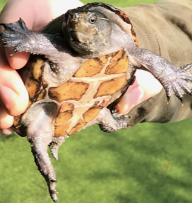
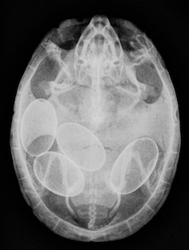

```{r message=FALSE, warning=FALSE}
## Packages used for thesis analysis
knitr::opts_chunk$set(echo = TRUE)
packages_needed <- c("ggplot2", # graphics
                     "arm", # display() etc.
                     "ggfortify", # check model assumptions
                     "AICcmodavg",
                     "grid"
                     )
pk_to_install <- packages_needed [!( packages_needed %in% rownames(installed.packages())  )]
if(length(pk_to_install)>0 ){
  install.packages(pk_to_install,repos="http://cran.r-project.org")
}
#lapply(packages_needed, require, character.only = TRUE)
library(ggplot2)# to make plots 
library(arm)
library(ggfortify)
library(AICcmodavg)
library(grid)
library(tidyr)
library(dplyr)
library(knitr)
library(readr)
library(nlme)
library(lme4)
library(MuMIn)
library(readr)
library(rgdal)
library(plyr)
library(arm)
library(MASS)
library(AICcmodavg)
library(pspearman)
library(cowplot)
library(rmdformats)

```


#Introduction
<br>

{width=250px}
        


Life history suggest that individuals adopt optimized allocation strategies to partition available energy to the competing processes of maintenance, growth, and reproduction (Fisher 1930; Stearns 1976; Congdon and Tinkle 1982; Congdon et al. 1982). 
Reproductive output is constrained by both energy availability and by limitations of the environment (James and Whitford 1994).Thus, the energetic resources available for reproduction are finite and often tradeoffs exist between allocating energy towards mate acquisition (search time and courtship), number and size of offspring,and parental care (Congdon and Tinkle 1982; Congdon 1989). In reproducing 
individuals these tradeoffs can come at the cost of increased food requirements, increased chances of mortality, slowed growth, and reduced mobility (Coleman and Whittall 1988; Tallamy and Denno 1982; Shine 1980).


Theoretical models suggest that energetic costs of reproduction can be put in two major components: 1) reproductive effort, the total resources available to be allocated to reproductive activities (courtship, egg production) and 2) parental investment, how total reproductive effort is allocated towards individual offspring (Congdon et al. 1982). Parental investment can be further partitioned into embryogenesis, parental investment to embryo development, and care of offspring pre or post birth (Congdon 1989; Congdon and Gibbons 1985). Parental care has most often been studied in species where offspring survival is primarily influenced by maternal investment post-birth, as in many altricial mammals and birds (Broderick et al. 2003; Rafferty and Reina 2012). In oviparous reptiles, however, the investment of energy to parental care is primarily limited to eggs prior to oviposition (Packard and Packard 1988). Available energy is budgeted into mate acquisition and fertilization, vitellogenesis, egg production, oviductal egg retention (post-fertlization), and nest site selection (Owens 1980; Wallace et al. 2006; Congdon et al 1983; Congdon 1989). 

Oviductal egg retention is a pivotal reproductive strategy for regulating timing in oviposition in many oviparous species (Renfree and Shaw 2000; Lopes et al 2004; Rafferty and Reina 2012).  Egg retention allows reproductive flexibility by permitting females the ability to prolong oviposition until environmental conditions are suitable or until they can locate appropriate nesting sites. They may also use this strategy to time oviposition to increase the chances of synchronized hatching of clutches among conspecifics…predator dilution (Ewert 1979; Andrews 2004; Rafferty and Reina 2012).  Squamates, crocodilians, and chelonians have the greatest diversity in prolonging egg retention (Ewert 1991). The oviductal egg retention period and developmental arrest for most squamates is about 25%- 40% of the total embryonic period, while in turtles this period can be more prolonged (Shine 1983; DeMarco 1993; Ewert 1985; Rafferty and Reina 2012; Andrews and Mathies 2000).  

 Most turtles exhibit oviductal egg retention (Ewert 1985), and once eggs have been fertilized, they develop a calcified shell and are retained in the oviduct. Embryonic development is then arrested, and eggs remain at the Gastrula stage and are retained for an extended period of time before oviposition (Ewert 1985; Rafferty and Reina 2012). Timing of oviductal egg retention differs among chelonians with some species retaining eggs for only a couple of days as observed in the leatherback sea turtle (<10 days) (Boulon et al. 1996; Girondot and Fretey 1996) to some species retaining eggs for a couple months (Pseudemydura umbrina 35-49 days) to others retaining eggs for half a year (Deirochelys reticularia 4-6.5 months) (Kutchling 1999; Buhlmann et al. 1995). Despite pronounced differences in duration of egg retention, no studies have yet focused on the energetic costs of this important life strategy, rather most studies have primarily focused on the total energetic costs of reproduction (Schwarzkopf and Shine 1992; Stewart 2013). 


**Aim**
The aim of this study was to assess the energetic cost of oviductal egg retention in Eastern Musk Turtles (Sternotherus odoratus), a species that actively uses oviductal egg retention over the reproductive season (Risley 1933). 

**Hypothesis**

We hypothesize that oviductal egg retention is a beneficial reproductive strategy because it permits flexibility in timing of oviposition at a relatively low energetic cost to the mother.  

**Predictions**

These energetic costs should also be influenced by the relative tradeoffs in the allocation of reproductive materials within a clutch, and therefore costs of retention should increase as a function of increased clutch mass and clutch size


#Site Description
<br>

Musk Turtles (Sternotherus odoratus) were captured from backwater sloughs along the Cumberland River, Cheatham County, Tennessee using Jones traps (Chandler et al. 2017).Traps were baited with canned tuna or sardines and placed in water deep enough to be mostly submerged, which allowed them to be left overnight and be checked the following day. Traps were left in the same location for a week prior to being moved. Traps were placed in murky/muddy water with duckweed covering.Trapping was conducted during the reproductive season from mid-May to September (Mitchell 1985, Ernst 1986, Ford and Moll 2004).

```{r message=FALSE, warning=FALSE, include=FALSE}
packages<-c("ggsn","leaflet","mapdata","maptools","OpenStreetMap","rgdal","smoothr","sf","sp","tidyverse","tmap")
sapply(packages, require, character.only=T)

```


```{r}
state <- map_data("state")
county <- map_data("county")
swamp_point <- data.frame("x" = -87.079223, "y" = 36.285647)
```

```{r}
tn <- county %>% 
  filter(region=="tennessee")

montco <- county %>% 
  filter(region=="tennessee") %>% 
  filter(subregion=="cheatham")
```


```{r}
map1<- ggplot() + geom_polygon(data = state, aes(x=long, y = lat, group = group),
                        fill = "white", color="black") + 
           geom_polygon(data = tn, aes(x=long, y = lat, group = group),
                        fill = "lightgrey", color="black") + 
           geom_polygon(data = montco, aes(x=long, y = lat, group = group),
                        fill = "darkgoldenrod2", color="black") + 
           geom_point(data = swamp_point, aes(x=x,y=y), color=" black") +
  coord_fixed(xlim = c(-91, -81),  ylim = c(34, 37), ratio = 1.2) + 
  xlab("Longitude") + ylab("Latitude") + ggtitle("Ashland City, Cheatham Co., TN")
map1
```


```{r message=FALSE, warning=FALSE}
sterno_traping <- read_csv("sterno_traping.csv")
```


```{r}
library(leaflet)
pal <- colorFactor(c( "brown", "darkgoldenrod2"), level = c("Absence", "Presence"))

map2<-leaflet(sterno_traping) %>% addProviderTiles(providers$Esri.WorldImagery) %>%
  addCircleMarkers(
    color = ~pal(Trap_Status),
    stroke = FALSE, fillOpacity = 0.5
  )%>%
   addLegend("bottomright", pal = pal, values = ~Trap_Status,
    title = "Turtle Trap Success",
    opacity = 1)
map2
```


# Methods 
<br>

{width=250px}


- All turtes were brought back to the lab to be measured, given a unique marking, and if female were x-rayed to determine reproductive state (Gravid vs Non-Gravid)

- Carbon dioxide production (VCO2) was measured for each individuals using flow through respirometry(Lighton 2008)

- Metabolic measurements were taken once for males and non-gravid females, while both gravid metabolic rate and post oviposition metabolic rates were determined for each gravid female

- Before intitiating a metabolic trial, turtles were fasted for 72 hours to allow food to clear the gut and ensure a post-absorptive digestive state

- Temperature was controlled at a constant 25 degrees celcius and a 12:12 photoperiod was used for the duration of a 48 hr testing cycle

- Carbon dioxide production was calculated at 3 sec intervals for the 48 h testing cycle, and the most level 15 min period from each 30 min sample was used to calculate the rate of gas exchange using the equations from Withers (1977) implemented in the program Lab Analyst (Warthog Systems)

- Metabolic rate for each individual was considered to be the mean of the three lowest 15 min measurements during 48 h test period 

- Gravid females were measured over a weekly basis to obtain multiple measurements and were allowed to naturally oviposit eggs within a nest

- Clutch metabolic rates were measured 24 hours post-oviposition using closed circuit O2 respirometer 


```{r message=FALSE, warning=FALSE, include=FALSE}
Sterno_All <- read_csv("Sterno_All.csv")# this data sett includes data for males, gravid females, and non-gravid females
```

```{r include=FALSE}
names(Sterno_All) <- c("Turtle_ID", "Group", "mL_CO2_hr_turtles", "Turtle_Mass","ml_O2_min_eggs", "whole_clutch_mass","ml_O2_hr_eggs")
```


#Statisitcal Analyses
<br>

I used a Gaussian log-link Generalized Linear Mixed Model (GLMM) fit with all combinations of predictors variables (female body mass, clutch mass, days leading to oviposition, and clutch metabolic rate) and an individual-level random effect of Turtle ID to determine influences on mass-adjusted metabolic rates. The supported models (delta AICc less than 2) were compared by using Akaike’ Information Criterion adjusted for a small sample size (AICc; Burnham and Anderson 2002). The best model was then used to determine whether days leading up to oviposition influenced the metabolism of gravid females.A General Linear Model (GLM, normally distributed errors) was used to determine differences between GMR and POMR (with female body mass as a covariate), indicating the energetic costs of oviductal egg retention. A GLM was also used to compare differences in metabolism among males, non-gravid females, and gravid females (adjusted for clutch mass and clutch metabolism) using body mass of each individual as a covariate. Linear regression was used to determine whether whole clutch mass, clutch size (number of eggs per clutch), whole clutch metabolic rate, female body mass, or mean egg width significantly influenced the total cost of oviductal egg retention (AGMR – POMR)

**Adjusting for Egg Metabolism**

Before we can run any tests we need to calculate energy produced during the respirometry run we need to convert our mL CO2/hr into joules/hr using conversion factors. The conversion factors were taken from Gessaman and Nagey 1988 and Reid et al 2009. 

*Egg energy expenditure:*
Conversion factor from Reid et al. 2009 
VO2 converstion factor= 20.1 J/ml O2

*Turtle energy expenditure:* 
Conversion factor from Gessaman and Nagy 1988
VCO2 converstion factor= 24.32 KJ/ml CO2

After converting metabolic rates from mLCO2/h to joules/h we need to them subtract the metabolic rates of the whole clutch from the respected gravid female because we only want to examine the gravid females metabolic rate.


```{r include=FALSE}
full_data_metabolic_rates<- Sterno_All%>% 
  mutate(Joules_hr_turtles= mL_CO2_hr_turtles*24.32)# we times the ml_CO2_hr_turtles by this conversion factor in order to joules Hr of energy
kable(full_data_metabolic_rates[1:10,],format = "pandoc", caption = 'Table 1. A knitr kable metabolic rates of Musk Turtle data.')
```


```{r include=FALSE}
full_data_metabolic_rates_2<- full_data_metabolic_rates%>% 
  mutate(Joules_hr_whole_clutch= ml_O2_hr_eggs*20.1)
kable(full_data_metabolic_rates_2[1:10,],format = "pandoc", caption = 'Table 1. A knitr kable metabolic rates of Musk Turtle data.')
```


```{r include=FALSE}
adjusting_metabolic_rates_gravid_females<- full_data_metabolic_rates_2%>%
  mutate(adj_energy_Joules_turtles=Joules_hr_turtles-Joules_hr_whole_clutch)
kable(adjusting_metabolic_rates_gravid_females[1:10,],format = "pandoc", caption = 'Table 1. Adjusted metabolic rates for Eastern Musk Turtles.')
```


```{r include=FALSE}
Juveniles_Out <- adjusting_metabolic_rates_gravid_females[-c(14,15,16,17,18),] # taking the juveniles out because they have such different metabolic rates doesnt make sense to try to compare them to adults
```

```{r include=FALSE}
head(Juveniles_Out)
```

**Data Description**

Below is a description of all the factor variables included within my data set. 


**Turtle_ID**: 54 total individuals

**Group**: Gravid Females, Males, Non-Gravid Females

**mlCO2/hr turtles**: measured metabolic rates

**Turtle_Mass**: Individual turtle mass to the nearest gram

**mlO2/min eggs**: measured metabolic rates for whole clutch of eggs

**Whole clutch mass**: reported weigths(g) of the entire clutch for each gravid female

**mlO2/hr eggs**: measured metabolic rates for whole clutch of eggs

**Joules/hr turtles**: calculated joules per hour used my indivudal turtles using the conversion factor

**Joules/hr whole clutch**: calculated joules per hour used by the whole clutch from each gravid female

**adj_energy_joules_turtles**: subtracting the joules/hr for the clutch from each of the gravid females


```{r}
Joules<- Juveniles_Out%>%
  mutate(adj_mass_turtles=Turtle_Mass- whole_clutch_mass)
kable(Joules[1:10,],format = "pandoc", caption = 'Table 6. A knitr kable Gravid SMR Musk Turtle data.')
```

## Group Metabolic Rates
<br>

### Adjustment of Metabolic Rates 
```{r}
#Adjusted means 
#mean of the covariate,  
X.mean <- mean(Joules$adj_mass_turtles) 

#equal slopes ANCOVA
model2 <- lm(adj_energy_Joules_turtles~ adj_mass_turtles+ Group, Joules)
anova(model2)
summary(model2)

#fits linear prediction lines (equal slopes)
pred <- predict(model2) 
```

```{r}
#plot same slopes model and show the adjusted mean using a dashed line
ggplot(data = cbind(Joules, pred), aes(x=adj_mass_turtles, adj_energy_Joules_turtles,lty=Group, pch=Group ))+
  geom_point(aes(size = 10))+
  geom_line(aes(y=pred,size=1)) +
  geom_vline(xintercept = X.mean, linetype ="dashed")+
  xlab("Body Mass (g)") + ylab("Metabolism (J/h)")+
  theme_bw(base_size = 10)+
  theme(legend.position = "none")+
  ggtitle("Body Mass and VCO2 with Adjusted Mean")+
 theme(plot.title = element_text(hjust=0.5))
```

```{r}
library(dplyr)
#adjust each data point to the mean of the covariate, along common slope
comm.slope <-coef(model2)[2]
data_adjusted <- Joules%>%mutate(adjVCO2=adj_energy_Joules_turtles-(comm.slope)*(adj_mass_turtles-X.mean))
```

```{r message=FALSE, warning=FALSE, include=FALSE}
mass_plot_2 <- ggplot(data = cbind(data_adjusted, pred), aes(adj_mass_turtles, adj_energy_Joules_turtles, pch=Group, colour=Group)) + 
  geom_point(size=6)+
  scale_colour_manual(values=c("grey27", "gray42", "gray67"))+
  geom_vline(xintercept = X.mean, linetype="dashed", alpha = 0.70)+
  geom_segment(aes(x=adj_mass_turtles, xend=X.mean, y=adj_energy_Joules_turtles, yend=data_adjusted$adjVCO2), size=1.5)+
  #ggtitle("Points adjusted to mean of mass using common slope")+
   theme(plot.title = element_text(size=18))+
  xlab(expression(Body~Mass~(g))) + 
  ylab("Energy Expenditure (J/h)") + #common slope of all points
  theme(panel.background = element_blank())+ 
  theme(axis.line = element_line( size = 0.5, colour = "black"))+
  theme(axis.text.x = element_text(family="Times New Roman", vjust=0.5, size = 14),
         axis.text.y = element_text(family="Times New Roman", vjust = 0.5, size=14),
         axis.title.x = element_text(family="Times New Roman", size=15),
         axis.title.y= element_text(family="Times New Roman", size=15))
mass_plot_2
```

```{r}
mass_adj_plot<-mass_plot_2+ scale_x_continuous(breaks = c(50, 60, 70, 80,90, 100, 110, 120,130,140,150,160,170,180,190))+scale_y_continuous(breaks=c(20, 30, 40,50,60,70,80,90,100,110,120,130,140,150,160,170,180))
```

```{r, fig.height=8, fig.width= 10,  message=FALSE, warning=FALSE}
gravid_1<-mass_adj_plot+ guides(fill = guide_legend(keywidth = 1, keyheight = 1, cex=0.75),
    linetype=guide_legend(keywidth = 4, keyheight = 1),
    colour=guide_legend(keywidth = 4, keyheight = 1))+
   theme(legend.position = c(.20,.89),legend.key= element_blank(),legend.background = element_rect(color = "black"),
         axis.text.x = element_text(family="Times New Roman",vjust=0.5, size = 18),
         axis.text.y = element_text(family="Times New Roman", vjust = 0.5, size=18),
         axis.title.x = element_text(family="Times New Roman", size=18),
         axis.title.y= element_text(family="Times New Roman", size=18),
         legend.text = element_text(family="Times New Roman",color = "black",size = 16))
gravid_1
```

```{r}
png('body_mass.png', pointsize = 10, width=2700, height = 2000, res=300)
gravid_1<-mass_adj_plot+ guides(fill = guide_legend(keywidth = 1, keyheight = 1, cex=0.75),
    linetype=guide_legend(keywidth = 4, keyheight = 1),
    colour=guide_legend(keywidth = 4, keyheight = 1))+
   theme(legend.position = c(.20,.89),legend.key= element_blank(),legend.background = element_rect(color = "black"),
         axis.text.x = element_text(family="Times New Roman",vjust=0.5, size = 18),
         axis.text.y = element_text(family="Times New Roman", vjust = 0.5, size=18),
         axis.title.x = element_text(family="Times New Roman", size=18),
         axis.title.y= element_text(family="Times New Roman", size=18),
         legend.text = element_text(family="Times New Roman",color = "black",size = 16))
gravid_1
dev.off() 
```


```{r}
Joules_energy_sterno<- Juveniles_Out%>%
  mutate(adj_mass_turtles=Turtle_Mass-whole_clutch_mass)
#kable(Joules_energy_sterno[1:10,],format = "pandoc", caption = 'Table 6. A knitr kable Gravid SMR Musk Turtle data.')
```


```{r include=FALSE}
X.mean <- mean(Joules_energy_sterno$adj_mass_turtles) #mean of the covariate
model_SMR <- lm(adj_energy_Joules_turtles ~ adj_mass_turtles+ Group, data=Joules_energy_sterno)
pred <- predict(model_SMR)
plot_SMR<- ggplot(data = cbind(Joules_energy_sterno, pred),
                 aes(adj_mass_turtles, adj_energy_Joules_turtles, lty=Group, pch=Group, colour=Group)) + geom_point(size=6) +
  geom_line(aes(y=pred), size=2)+
  geom_vline(xintercept = X.mean, alpha = 0.15)+
  xlab("Body Mass (g)")+
  ylab("Energy Expenditure (J/h)")+
  scale_colour_manual(values=c("grey27", "gray42", "gray67"))+
  theme_classic(base_size = 15)
  


plot_SMR+labs(colour= "Sex", linetype="Sex", pch="Group")
```


```{r include=FALSE}
plot_SMR+ guides(fill = guide_legend(keywidth = 1, keyheight = 1),
    linetype=guide_legend(keywidth = 4, keyheight = 1),
    colour=guide_legend(keywidth = 4, keyheight = 1))
```


```{r}
gravid_plot<- plot_SMR+ scale_x_continuous(breaks = c(50, 60, 70, 80,90, 100, 110, 120,130,140,150,160,170,180,190))+scale_y_continuous(breaks=c(20, 30, 40,50,60,70,80,90,100,110,120,130,140,150,160,170,180))
```


```{r, fig.width=10, fig.height=8}
# after adjusting for adult turtle metabolic rates 
gravid_plot+ guides(fill = guide_legend(keywidth = 1, keyheight = 1, cex=0.75),
    linetype=guide_legend(keywidth = 4, keyheight = 1),
    colour=guide_legend(keywidth = 4, keyheight = 1))+
   theme(legend.position = c(.17,.90),
         legend.background = element_rect(color = "black"),
         axis.text.x = element_text(family="Times New Roman",vjust=0.5, size = 18),
         axis.text.y = element_text(family="Times New Roman",vjust = 0.5, size=18),
         axis.title.x = element_text(family="Times New Roman",size=18),
         axis.title.y= element_text(family="Times New Roman",size=18),
         legend.text = element_text(family="Times New Roman",color = "black",size = 16))
gravid_plot
```


```{r}
png('all_turtles.png', pointsize = 10, width=2700, height = 2000, res=300)
gravid<-gravid_plot+ guides(fill = guide_legend(keywidth = 1, keyheight = 1, cex=0.75),
    linetype=guide_legend(keywidth = 4, keyheight = 1),
    colour=guide_legend(keywidth = 4, keyheight = 1))+
   theme(legend.position = c(.20,.89),legend.background = element_rect(color = "black"),
         axis.text.x = element_text(family="Times New Roman",vjust=0.5, size = 18),
         axis.text.y = element_text(family="Times New Roman",vjust = 0.5, size=18),
         axis.title.x = element_text(family="Times New Roman",size=18),
         axis.title.y= element_text(family="Times New Roman",size=18),
         legend.text = element_text(family="Times New Roman",color = "black",size = 16))
gravid
dev.off()
```

All turtles have a positive correlation in metabolic rates (joules/hr) while accounting for the adjusted turtle mass (subtracting the gravid female's clutch mass from her mass in order to get the actual mass of the female). From the graph it looks as though gravid females have a higher metabolic rate then do males and non-gravid females for the the reproductive season. We will run an ANCOVA with a pairwise test to determine if this is the case for these turtles.   


Before running an ANCOVA and a pairwise test I ran the an autoplot to check for potential outliers. Here we see in the normal Q-Q plot that three values (16,15,36) could be potential outliers, however, they do not seem to deviate from the line too much so they may be okay.The first and third plot do not show any signficant pattern which is good. 


### Normality 

```{r}
autoplot(model_SMR)
```


### ANCOVA 
<br>
I ran an ANCOVA with adjusted means analysis in order to determine the average metabolic rates for each group while accounting for the covariate of body mass.

```{r message=FALSE, warning=FALSE}
smr<- lm(adj_energy_Joules_turtles~ adj_mass_turtles+Group, data=Joules_energy_sterno, digits=5)
anova(smr)
```

```{r}
kable(anova(smr), format = "pandoc", caption ='Table 1. A summary kable displaying ANOVA summary table.')
```

```{r}
summary(smr)
```


The ANCOVA results support the linear plot above in that group (gravid female, male, non-gravid female) is signficant in determing metabolic rates of the indivdual turtle.The adjusted mass also was signficantly correlated with metabolic rates of the turtles (joules/hr) with a p-value< 0.05.

### Emmeans 
<br>
In order to adjust for the difference in mass of the three groups of turtles we need to use the package library(emmeans) to run our model.


```{r}
library(emmeans)
adj_turtles_1<-emmeans(smr, ~ adj_mass_turtles:Group, digits=3)
adj_turtles_1
```


```{r}
options(digits=3)
pairs(adj_turtles_1)
```


After adjusting for the means of the metabolic rates we can now run a pairwise analysis to see if there were any differences among the group. Here we see that we get a signficant diffence between gravid females and males (p-value-0.022). A signficant difference is also seen between gravid females and non-gravid females (p-value=0.001). A nonsignficant difference is reported when looking at males and non-gravid females (p-value=0.388).


## Oviductal Egg Retention Period 
<br>

Before plotting the data out or running a glm we need to adjust for female body mass (weight ranges for this group ranged from 100-196g)


```{r message=FALSE, warning=FALSE, include=FALSE}
Time_Scale_2 <- read_csv("Time_Scale_2.csv")
```


```{r include=FALSE}
days_2<- Time_Scale_2[ -c( 7,14,19), ]
```

```{r}
head(days_2)
```


```{r}
#Adjusted means 
#mean of the covariate,  
X.mean <- mean(days_2$Female_Mass_g) 

#equal slopes ANCOVA
model2 <- lm(SMR_ml_CO2_hr ~ Female_Mass_g, days_2)
anova(model2)
summary(model2)

#fits linear prediction lines (equal slopes)
pred1 <- predict(model2) 
```


```{r}
#plot same slopes model and show the adjusted mean using a dashed line
ggplot(data = cbind(days_2, pred1), aes(x= Female_Mass_g , y= SMR_ml_CO2_hr))+
  geom_point(aes(size = 10))+
  geom_line(aes(y=pred1)) +
  geom_vline(xintercept = X.mean, linetype ="dashed")+
  xlab("Body Mass (g)") + ylab(expression(CO[2]~Production~(mL~h^-1)))+
  theme_bw(base_size = 10)+
  theme(legend.position = "none")+
  ggtitle("Body Mass and VCO2 with Adjusted Mean")+
 theme(plot.title = element_text(hjust=0.5))
```

```{r}
library(dplyr)
#adjust each data point to the mean of the covariate, along common slope
comm.slope <-coef(model2)[2]
data_adjusted <- days_2%>%mutate(adjVCO2=SMR_ml_CO2_hr-(comm.slope)*(Female_Mass_g-X.mean))
```

```{r}
mass_plot_2 <- ggplot(data = cbind(data_adjusted, pred1), aes(Female_Mass_g, SMR_ml_CO2_hr)) + 
  geom_point()+
  scale_x_continuous(breaks=c(90,100,110,120,130,140,150,160,170,180,190,200,210))+ 
  geom_vline(xintercept = X.mean, linetype="dashed", alpha = 0.45)+
  geom_segment(aes(x=Female_Mass_g, xend=X.mean, y=SMR_ml_CO2_hr, yend=data_adjusted$adjVCO2), size=.25)+
  #ggtitle("Points adjusted to mean of mass using common slope")+
   theme(plot.title = element_text(size=18))+
  xlab(expression(Body~Mass~(g))) + 
  ylab(expression(CO[2]~Production~(mL~h^-1))) + 
 geom_line(aes(y=pred1), linetype="solid", size=1) +#common slope of all points
  theme(panel.background = element_blank())+ 
  theme(axis.line = element_line(size = 0.5, colour = "black"))+
  theme(axis.text.x = element_text(vjust=0.5, size = 14),
         axis.text.y = element_text(vjust = 0.5, size=14),
         axis.title.x = element_text(size=15),
         axis.title.y= element_text(size=15))

```

```{r}
mass_plot_2
```
Fig. # Adjusting 15 gravid females metabolic rates by adjusting each point to the mean of the covariate and fitting them along a common slope

```{r}
Joules_energy_sterno<- data_adjusted%>%
  mutate(GMR=adjVCO2*24.32)
kable(Joules_energy_sterno[1:10,],format = "pandoc", caption = 'Table 6. A knitr kable Gravid SMR Musk Turtle data.')
```

```{r}
#plotting all females oviductal egg retention period out 
time_plot_adjusted<- ggplot(data = Joules_energy_sterno, aes(x = Days_To_Oviposition, y = GMR)) + 
  geom_point(aes(shape=Status), size=3)+
   scale_shape_manual(values = c(16, 1))+
   geom_point(aes(x=7, y=73.3), colour="black", pch=2, size=8)+
  geom_vline(xintercept = 0, col="black", alpha=0.7, linetype="solid")+
  geom_segment(aes(x=-75,xend=-2,y=103.4,yend=103.4), linetype="dashed", alpha=0.7)+
  xlab("Days Before Oviposition")+
  ylab("Energy Expenditure(J/h)")+
  theme_classic()
```


```{r}
plot_adjusted<-time_plot_adjusted+ scale_x_continuous(breaks = c(-80, -75, -70,-65, -60,-55,-50,-45,-40,-35,-30,-25,-20,-15,-10,-5, 0,5, 10))+scale_y_continuous(breaks=c(40, 50,60,70,80,90,100,110,120,130,140,150,160,170,180))+
  theme(axis.text.x = element_text(family="Times New Roman", vjust=0.5, size = 18),
         axis.text.y = element_text(family="Times New Roman", vjust = 0.5, size=18),
         axis.title.x = element_text(family="Times New Roman", size=18),
         axis.title.y= element_text(family="Times New Roman", size=18))
  
```

*Oviducal Egg retention Period* 


```{r fig.height=7, fig.width=10, message=FALSE, warning=FALSE, include=FALSE}
final_plot<- plot_adjusted + geom_smooth(method = "lm", formula = y ~ poly(x, 3), se = FALSE, colour="black")+ theme(legend.position = c(.88,.90), legend.text = element_text(family="Times New Roman", color = "black", size = 16),legend.background = element_rect(color = "black"))
final_plot
```

```{r, fig.height=7, fig.width=10}
final_plot+labs(pch="Reproductive Status")
```

The costs of Oviductal Egg Retention for all 15 gravid females decreased slightly across days or remained contant throughout oviductal egg retention. 

```{r}
png('Metabolism_daystoov.png',pointsize=10,width=2500,height=2000,res=300)
final_plot+labs(pch="Reproductive Status")
dev.off()
```


```{r}
# plot to look at all 15 females over the oviductal egg retention period 
time_plot<- ggplot(data = Joules_energy_sterno, aes(x = Days_To_Oviposition, y = GMR, colour=Turtle_ID)) + 
  geom_point(size=4)+
  geom_smooth(method="lm", se=FALSE, size=1)+
   scale_shape_manual(values = c(16, 1))+
  scale_colour_manual(values=c("grey37", "gray37", "gray37","gray37","gray37","gray37","gray37","gray37","gray37","gray37","gray37","gray37","gray37","gray37","gray37"))+
   geom_point(aes(x=7, y=73.3), colour="black", pch=2, size=10, lwd=5)+
  geom_vline(xintercept = 0, col="black", alpha=0.7, linetype="solid")+
  geom_segment(aes(x=-75,xend=-2,y=103.4,yend=103.4), linetype="dashed",size=1, colour="black")+
  xlab("Days Before Oviposition")+
  ylab(" Energy Expenditure(J/h)")+
  theme_classic()+
  theme(legend.position="none", axis.text.x = element_text(vjust=0.5, size = 16),
         axis.text.y = element_text(vjust = 0.5, size=16),
         axis.title.x = element_text(size=16),
         axis.title.y= element_text(size=16)) 

```


```{r fig.height=6, fig.width=8, message=FALSE, warning=FALSE}
plot<-time_plot+ scale_x_continuous(breaks = c(-75, -70,-65, -60,-55,-50,-45,-40,-35,-30,-25,-20,-15,-10,-5, 0,5, 10))+
  scale_y_continuous(breaks=c(40, 50,60,70,80,90,100,110,120,130,140,150,160,170,180))
 

     
 plot
```

```{r}
png('all_turtles.png', pointsize = 10, width=2700, height = 2000, res=300)
plot<-time_plot+ scale_x_continuous(breaks = c(-75, -70,-65, -60,-55,-50,-45,-40,-35,-30,-25,-20,-15,-10,-5, 0,5, 10))+
  scale_y_continuous(breaks=c(40, 50,60,70,80,90,100,110,120,130,140,150,160,170,180))
 

     
 plot
dev.off()
```

```{r}
# plot looks at only the oviductal egg retention period for all 15 gravid females 
time_plot<-ggplot(data = Joules_energy_sterno, aes(x = Days_To_Oviposition, y = GMR,shape= Status, colour=Turtle_ID, fill=Turtle_ID)) +
  geom_smooth(method="lm", se=FALSE, size=1) +
  scale_colour_manual(values=c("gray42", "gray42", "gray42","gray42", "gray42", "gray42","gray42", "gray42", "gray42", "gray42", "gray42", "gray42", "gray42","gray42", "gray42"))+
  geom_point(size=4) +
  scale_shape_manual(values = c(16, 1))+
  geom_point(aes(x=7, y=73.3), colour="black", pch=2, size=8)+
  geom_vline(xintercept = 0, col="black", alpha=0.7, linetype="solid")+
  geom_segment(aes(x=-75,xend=-2,y=103.4,yend=103.4), linetype="dashed", alpha=1.0, colour="black", size=.75)+
  xlab("Days Before Oviposition")+ ylab("Energy Expenditure (J/h)")+
  theme_classic()+
  theme(legend.position="none",  axis.text.x = element_text(vjust=0.5, size = 16),
         axis.text.y = element_text(vjust = 0.5, size=16),
         axis.title.x = element_text(size=16),
         axis.title.y= element_text(size=16))

```


```{r}
plot<-time_plot+scale_x_continuous(breaks = c(-75, -70,-65, -60,-55,-50,-45,-40,-35,-30,-25,-20,-15,-10,-5, 0,5, 10))+
  scale_y_continuous(breaks=c(40, 50,60,70,80,90,100,110,120,130,140,150,160,170,180))
plot
```


##GLMM (Gaussion log-link)
<br>


```{r message=FALSE, warning=FALSE}
Time_Scale_2 <- read_csv("Time_Scale_2.csv")
```

```{r}
adjusting_J<- Time_Scale_2%>% 
  mutate(Joules_hr_females= SMR_ml_CO2_hr*24.32)# we times the ml_CO2_hr_turtles by this conversion factor in order to joules Hr of energy
kable(adjusting_J[1:10,],format = "pandoc", caption = 'Table 1. A knitr kable metabolic rates of Musk Turtle data.')
```


```{r}
egg_J<-adjusting_J %>% 
  mutate(Joules_hr_eggs= Egg_SMR_ml_O2_hr*20.1)
kable(egg_J[1:10,],format = "pandoc", caption = 'Table 1. A knitr kable metabolic rates of Musk Turtle data.')
```


```{r}
# Checking for collinerarty among predictor variables 
glmer_data_mod<-egg_J[,c("Turtle_ID", "Status_2", "Joules_hr_females", "Days_To_Oviposition", "Female_Mass_g", "Joules_hr_eggs","Egg_Mass_g","Clutch_Size")]
```

```{r}
corr.macro<-cor(glmer_data_mod[,3:8],method="kendall")
corr.macro
```

So it looks like we have some correlation occuring between the egg metabolic rate and egg mass and clutch size, so we shall keep egg metabolic rate in. P-values above 0.6 are considered to be correlated 

```{r}
means <- ddply(egg_J, "Status", summarise, rating.mean=mean(Joules_hr_females))
means
ggplot(egg_J, aes(x=Joules_hr_females)) + geom_histogram(binwidth=1, colour="black", fill="white") + 
  facet_grid(Status ~ .) +
  scale_x_continuous(breaks=seq(0,30,5)) +
  ggtitle("Poisson Distributions With Differing Means") +
  geom_vline(data=means, aes(xintercept=rating.mean), linetype="dashed", size=1, colour="red")
```

The top graph looks to be normally distributed meaning we should run a gaussion model 

```{r}
non_gravid_Out <- egg_J[-c(42,43,44,45,46,47,48,49,50,51,52,53,54,55,56),]# taking out non-gravid because we just want to look at gravid metabolic rates of females 
```

CANDIDATE MODEL SET FOR AIC CRITERIA

```{r}
cand.models <- list()
```


```{r message=FALSE, warning=FALSE}
cand.models[[1]]<-glmer(Joules_hr_females~ Days_To_Oviposition+ Joules_hr_eggs+ Female_Mass_g+ Egg_Mass_g +(1|Turtle_ID), family="gaussian" (link="log"),data=non_gravid_Out)# uber global model
```

```{r message=FALSE, warning=FALSE}
cand.models[[2]]<-glmer(Joules_hr_females~ Days_To_Oviposition+ Joules_hr_eggs+ Egg_Mass_g+ (1|Turtle_ID), family= "gaussian" (link="log"),data=non_gravid_Out)# only looking at affects of eggs
```

```{r message=FALSE, warning=FALSE}
cand.models[[3]]<-glmer(Joules_hr_females~ Days_To_Oviposition+ Female_Mass_g+ (1|Turtle_ID), family="gaussian" (link="log"),data=non_gravid_Out)# taking out factor of eggs 
```

```{r}
cand.models[[4]]<-glmer(Joules_hr_females~ Days_To_Oviposition+ (1|Turtle_ID), family="gaussian" (link="log"),data=non_gravid_Out)# just looking at days leading up to oviposition 
```

```{r message=FALSE, warning=FALSE}
cand.models[[5]]<- glmer(Joules_hr_females~  (1|Turtle_ID), family="gaussian" (link="log"),data=non_gravid_Out)# null model
```

```{r}
Modname <-paste("m", 1:length(cand.models), sep = "")
aictab(cand.set = cand.models, modnames = Modname, second.ord = TRUE)
```

so model three is the best model for fitting this data set


 Summary of GLM

```{r message=FALSE, warning=FALSE}
best_model<-glmer(Joules_hr_females~ Days_To_Oviposition+ Female_Mass_g+ (1|Turtle_ID), family="gaussian" (link="log"),data=non_gravid_Out)
summary(best_model)
```

Days to leading up to oviposition was not signficant as was shown in the figure above. Female body mass is signficant in this case as well which is why we had to adjust for it. 

##GLM ANCOVA 
<br>

Testing to see if there are any differences between the average metabolic rate of each 15 gravid females pre-ovipositional metabolic rate and her post-ovipositional metabolic rate with female body mass as the covariate 


```{r message=FALSE, warning=FALSE}
Time_Scale_2 <- read_csv("Time_Scale_2.csv")
```


```{r}
#Calculating Joules per hour for female turtles
adjusting_J<- Time_Scale_2%>% 
  mutate(Joules_hr_females= SMR_ml_CO2_hr*24.32)# we times the ml_CO2_hr_turtles by this conversion factor in order to joules Hr of energy
kable(adjusting_J[1:10,],format = "pandoc", caption = 'Table 1. A knitr kable metabolic rates of Musk Turtle data.')
```


```{r}
#Calculating Joule per hour eggs
egg_J<-adjusting_J %>% 
  mutate(Joules_hr_eggs= Egg_SMR_ml_O2_hr*20.1)
kable(egg_J[1:10,],format = "pandoc", caption = 'Table 1. A knitr kable metabolic rates of Musk Turtle data.')
```

Subtracting eggs from mother 


```{r}
adj_energy_gravid<-egg_J %>%
  mutate(adj_J_females=Joules_hr_females-Joules_hr_eggs)
kable(adj_energy_gravid[1:13,],format = "pandoc", caption = 'Table 7. A knitr kable Gravid SMR Musk Turtle data.')
```

```{r}
adj_gravid_mass<-adj_energy_gravid %>%
  mutate(adj_mass=Female_Mass_g-Egg_Mass_g)
kable(adj_gravid_mass[1:13,],format = "pandoc", caption = 'Table 8. A knitr kable Gravid SMR Musk Turtle data.')
```

```{r message=FALSE, warning=FALSE}
gravid_data_2 <- read_csv("gravid_data_2.csv")
```

```{r}
GMR<-gravid_data_2%>%
  mutate(adj_J=SMR*24.32)
kable(GMR[1:13,],format = "pandoc", caption = 'Table 8. A knitr kable Gravid SMR Musk Turtle data.')
```

```{r}
x1  = factor(GMR$Status, levels=c("Pre-Oviposition", "Post-Oviposition"))# this positions the variables in the correct order 
```


```{r fig.height=5, fig.width=5, message=FALSE, warning=FALSE}
#Spaghetti Plot of Pre and Post Oviposition
line<-ggplot(data = GMR, aes(x =x1, y = adj_J, group = Turtle_ID, color=Turtle_ID))+ geom_boxplot(data = GMR, aes(x=x1, y=adj_J, group=x1, width = 0.8))+
    geom_line(lwd=0.75,size=1) + 
  scale_y_continuous(breaks=c(20, 30, 40,50,60,70,80,90,100,110,120,130,140,150,160,170,180))+
  scale_colour_manual(values=c("gray42","gray42","gray42","gray42","gray42","gray42","gray42","gray42","gray42","gray42","gray42","gray42","gray42","gray42","gray42", "gray42", "gray42"))+
geom_point(size=2)+
  xlab("Time")+
  ylab("Energy Expenditure (J/h)")+
  theme_bw()+
  theme( axis.text.x = element_text(family="Times New Roman", vjust=0.5, size = 16),
         axis.text.y = element_text(family="Times New Roman", vjust = 0.5, size=16),
         axis.title.x = element_text(family="Times New Roman", size=16),
         axis.title.y= element_text(family="Times New Roman", size=16))+
  theme(legend.position = "none")
  line
```

```{r}
png('all_fem.png', pointsize = 10, width=2700, height = 2000, res=300)
line<-ggplot(data = GMR, aes(x =x1, y = adj_J, group = Turtle_ID, color=Turtle_ID))+ geom_boxplot(data = GMR, aes(x=x1, y=adj_J, group=x1, width = 0.8))+
    geom_line(lwd=0.75,size=1) + 
  scale_y_continuous(breaks=c(20, 30, 40,50,60,70,80,90,100,110,120,130,140,150,160,170,180))+
  scale_colour_manual(values=c("gray42","gray42","gray42","gray42","gray42","gray42","gray42","gray42","gray42","gray42","gray42","gray42","gray42","gray42","gray42", "gray42", "gray42"))+
geom_point(size=2)+
  xlab("Time")+
  ylab("Energy Expenditure (J/h)")+
  theme_bw()+
  theme( axis.text.x = element_text(family="Times New Roman", vjust=0.5, size = 16),
         axis.text.y = element_text(family="Times New Roman", vjust = 0.5, size=16),
         axis.title.x = element_text(family="Times New Roman", size=16),
         axis.title.y= element_text(family="Times New Roman", size=16))+
  theme(legend.position = "none")
  line
dev.off()
```


```{r}
smr<- lm(adj_J_females~ adj_mass+Status, data=adj_gravid_mass,  REML = FALSE, digits=5)
anova(smr)
```

```{r}
adj_turtles_1<-emmeans(smr, ~ adj_mass:Status, digits=3)
adj_turtles_1
```


```{r}
pairs(adj_turtles_1)
```

We saw a 40% increase in metabolic rate from gravid females pre vs post oviposition metabolic rate 


##Lineaer Regressions 
<br>

Linear Regression were run to determine influences of 

- Clutch size
- Clutch mass
- Whole clutch metabolic rate 
- Female body mass


```{r message=FALSE, warning=FALSE}
gravid_data <- read_csv("gravid_data.csv")# data for all 15 gravid females
```


```{r include=FALSE}
## adjusting to energy expenditure of female turtles 
Gravid_J<-gravid_data%>%
  mutate(gravid_j_h= SMR_gravid*24.32)
kable(Gravid_J[1:13,],format = "pandoc", caption = 'Table 6. A knitr kable Gravid SMR Musk Turtle data.')
```


```{r include=FALSE}
Gravid_J_2<-Gravid_J%>%
  mutate(nongravid_j_h= SMR_nongravid*24.32)
kable(Gravid_J_2[1:13,],format = "pandoc", caption = 'Table 6. A knitr kable Gravid SMR Musk Turtle data.')
```


```{r include=FALSE}
# adjusting to energy expenditure of eggs 
Gravid_J_3<-Gravid_J_2%>%
  mutate(egg_j_h= Egg_SMR*20.1)
kable(Gravid_J_3[1:13,],format = "pandoc", caption = 'Table 6. A knitr kable Gravid SMR Musk Turtle data.')
```


```{r include=FALSE}
# adjusting to only what the females were using not the eggsd
AGMR<-Gravid_J_3%>%
  mutate(AGMR= gravid_j_h-egg_j_h)
kable(AGMR[1:13,],format = "pandoc", caption = 'Table 6. A knitr kable Gravid SMR Musk Turtle data.')
```

```{r include=FALSE}
Final<-AGMR%>%
  mutate(final= AGMR-nongravid_j_h)
kable(Final[1:13,],format = "pandoc", caption = 'Table 6. A knitr kable Gravid SMR Musk Turtle data.')
```

```{r include=FALSE}
Final_5<-AGMR%>%
  mutate(final= AGMR-nongravid_j_h)
kable(Final[1:13,],format = "pandoc", caption = 'Table 6. A knitr kable Gravid SMR Musk Turtle data.')
```


```{r include=FALSE}
Final_2<-Final%>%
  mutate(adj_mass= Female_Mass_g-Egg_Mass_g)
kable(Final_2[1:13,],format = "pandoc", caption = 'Table 6. A knitr kable Gravid SMR Musk Turtle data.')
```

```{r include=FALSE}
Final_2$Clutch_Size<- factor(Final_2$Clutch_Size, levels = c("Two", "Three", "Four", "Five","Six"))
```


```{r include=FALSE}
# plot to look at how clutch mass influences the costs of oviductal egg retention 
whole_clutch_mass<-ggplot(Final, aes(x = Egg_Mass_g,
                     y = final)) +
  geom_point(size=5) +
  geom_smooth(method = 'lm', color="black", se=T) +
  ylab("AGMR-POMR (J/h)") +
  xlab("Whole Clutch Mass (g) ")+ 
  scale_y_continuous(breaks=c(0,10,20,30,40,50,60))+
  theme_classic()+
  theme(axis.title.y = element_blank())
whole_clutch_mass
```

```{r}
clutch_mass<- whole_clutch_mass+geom_label(x=19, y=8,label="P= 0.03",family = "Times New Roman", size=6)+
  theme( axis.text.x = element_text(family="Times New Roman", vjust=0.5, size = 16),
         axis.text.y = element_text(family="Times New Roman",vjust = 0.5, size=16),
         axis.title.x = element_text(family="Times New Roman",size=16),
         axis.title.y = element_text(family="Times New Roman",size=16,angle = 90, hjust = .50 ))
clutch_mass
```

```{r}
# this code here exports the graph (keeps the figure pretty)
png('clutch_mass.png', pointsize = 10, width=2700, height = 2000, res=300)
clutch_mass<- whole_clutch_mass+geom_label(x=19, y=8,label="P= 0.03",family = "Times New Roman", size=6)+
  theme( axis.text.x = element_text(family="Times New Roman", vjust=0.5, size = 16),
         axis.text.y = element_text(family="Times New Roman",vjust = 0.5, size=16),
         axis.title.x = element_text(family="Times New Roman",size=16),
         axis.title.y = element_text(family="Times New Roman",size=16,angle = 90, hjust = .50 ))
clutch_mass
dev.off()
```


```{r include=FALSE}
# plot looking at how female body mass influences costs of oviductal egg retention 
female_mass<-ggplot(Final_2, aes(x=adj_mass, y=final))+
   geom_point(size=5) +
  ylab("AGMR-POMR (J/hr)") +
  xlab(" Female Mass (g) ")+
   scale_y_continuous(breaks=c(0,10,20,30,40,50,60))+
  scale_x_continuous(breaks = c(80,90,100,110,120,130,140,150,160,170,180,190,200))+
  theme_classic()+
  theme(axis.title.y = element_blank())
female_mass
```


```{r}
female_mass_g<- female_mass+geom_label(x=170, y=12,label="P= 0.34",family = "Times New Roman", size=6)+  theme( axis.text.x = element_text(family="Times New Roman", vjust=0.5, size = 16),
         axis.text.y = element_text(family="Times New Roman",vjust = 0.5, size=16),
         axis.title.x = element_text(family="Times New Roman",size=16),
         axis.title.y = element_text(family="Times New Roman",size=16,angle = 90, hjust = .50 ))

female_mass_g
```


```{r}
png('fmass.png', pointsize = 10, width=2700, height = 2000, res=300)
female_mass_g<- female_mass+geom_label(x=170, y=12,label="P= 0.34",family = "Times New Roman", size=6)+  theme( axis.text.x = element_text(family="Times New Roman", vjust=0.5, size = 16),
         axis.text.y = element_text(family="Times New Roman",vjust = 0.5, size=16),
         axis.title.x = element_text(family="Times New Roman",size=16),
         axis.title.y = element_text(family="Times New Roman",size=16,angle = 90, hjust = .50 ))

female_mass_g
dev.off()
```


```{r include=FALSE}
# plot to look at how clutch size influences the costs of oviductal egg retention 
clutch_size<-ggplot(Final_5, aes(x = Clutch_Size,
                     y = final)) +
  geom_point(size=5) +
  ylab("AGMR-POMR (J/h)") +
  xlab(" Clutch Size ")+ 
  scale_y_continuous(breaks=c(0,10,20,30,40,50,60,70))+
  theme_classic()+
  theme(axis.title.y = element_blank())
clutch_size
```

```{r}
clutch<- clutch_size+geom_label(x=5.75, y=12,label="P= 0.18",family = "Times New Roman", size=6)+  theme( axis.text.x = element_text(family="Times New Roman", vjust=0.5, size = 16),
         axis.text.y = element_text(family="Times New Roman",vjust = 0.5, size=16),
         axis.title.x = element_text(family="Times New Roman",size=16),axis.title.y= element_text(family="Times New Roman", size=16,angle = 90, hjust = .50))

clutch
```

```{r}
png('fmass.png', pointsize = 10, width=2700, height = 2000, res=300)
clutch<- clutch_size+geom_label(x=5.75, y=12,label="P= 0.18",family = "Times New Roman", size=6)+  theme( axis.text.x = element_text(family="Times New Roman", vjust=0.5, size = 16),
         axis.text.y = element_text(family="Times New Roman",vjust = 0.5, size=16),
         axis.title.x = element_text(family="Times New Roman",size=16),axis.title.y= element_text(family="Times New Roman", size=16,angle = 90, hjust = .50))

clutch
dev.off()
```

```{r include=FALSE}
# plots to look at how clutch mass influences the energy expenditure by the clutch 
Egg_energy_expenditure<-ggplot(Final_2, aes(x = Egg_Mass_g,
                     y = egg_j_h)) +
  geom_point(size=3) +
  geom_smooth(method = 'lm', color="black", se=T)+
  xlab("Whole Clutch Mass (g)")+
  ylab("Clutch Metabolic Rate (J/h)")+
  theme_classic()
Egg_energy_expenditure
```


```{r}
Eggs<- Egg_energy_expenditure+geom_label(x=19, y=0.15,label="P= 0.03",family = "Times New Roman", size=6)+
  theme( axis.text.x = element_text(family="Times New Roman", vjust=0.5, size = 14),
         axis.text.y = element_text(family="Times New Roman",vjust = 0.5, size=14),
         axis.title.x = element_text(family="Times New Roman",size=16),
         axis.title.y= element_text(family="Times New Roman", size=16))
Eggs
```

```{r}
png('fmass.png', pointsize = 10, width=2700, height = 2000, res=300)
Eggs<- Egg_energy_expenditure+geom_label(x=19, y=0.15,label="P= 0.03",family = "Times New Roman", size=6)+
  theme( axis.text.x = element_text(family="Times New Roman", vjust=0.5, size = 14),
         axis.text.y = element_text(family="Times New Roman",vjust = 0.5, size=14),
         axis.title.x = element_text(family="Times New Roman",size=16),
         axis.title.y= element_text(family="Times New Roman", size=16))
Eggs
dev.off()
```


```{r}
library(cowplot)# cowplots puts figures all into one 
plot<-plot_grid(clutch_mass,female_mass_g,clutch,Eggs, ncol=2, labels=c('A','B','C', 'D'))
plot
```

Dredging the data set 

```{r}
options(na.action = "na.fail")
```

```{r}
pairs(egg_J[,3:6], lower.panel = NULL)
```

```{r}
head(Final_2)
```


```{r}
eggs.all.parms<-lm(final~Clutch_Size+Egg_Mass_g+adj_mass, data = Final_2)

# the dredge function fits all combinations
# of the variables in the eggs.all.parms model fit above
results<-dredge(eggs.all.parms)
results
```

```{r}
importance(results)
```

So after dredging the model we can see that egg mass ( mass of the entire clutch)has the most influence on the costs of oviductal egg retention 

```{r}
modlm<- lm(final~Clutch_Size+Egg_Mass_g+ adj_mass, data = Final_2)
summary(modlm)# making a model with all predictor variables 
```

```{r}
modlm<- lm(final~Egg_Mass_g, data = Final_2)
summary(modlm) # since clutch mass was the only important predictor variable I made a model with just that
```

```{r}
modlm<- lm(final~ adj_mass, data = Final_2)
summary(modlm)
```

```{r}
head(Final_2)
```


```{r}
lm<- lm(egg_j_h~Egg_Mass_g, data=Final_2)
summary(lm)# model to look at clutch mass and clutch metabolic rate 
```

The energetic cost of oviductal egg retention (AGMR-POMR) was related to whole-clutch mass but there was no clear significance of female body mass (Fig. 6a, F1,13 = 5.89, P=0.03 and Fig. 6c, P=0.34) such that heavier clutches and heavier females increased gravid

female metabolic rate. There was no clear significance of clutch size on GMR (Fig.6b, F1,14= 2.15, P=0.18) but clutch mass did influence whole-clutch metabolic rates (Fig. 6d, F1,14= 5.31, P=0.03).


#Summary 
<br>

- Gravid females had a ~40% increase in metabolism while gravid, an increased energetic cost of reproduction associated with oviductal egg retention. 

- Metabolic costs associated with egg retention were relatively constant across days leading up to oviposition, potentially due to the state of developmental arrest of the embryos. 

- The energetic costs of oviductal egg retention were affected by the total clutch metabolism and whole clutch mass.

- Further, metabolic rates of gravid females were significantly elevated from males and non-gravid females indicating a substantial metabolic cost of reproduction for gravid females. 

- Eastern Musk Turtles (Sternotherus odoratus) energetic costs towards retaining eggs during oviductal egg production was more than double that of what was observed for Eastern Box Turtles (Terrapene carolina); 16% increase in energy compared to non-gravid energy investments (Clinger 2016).


